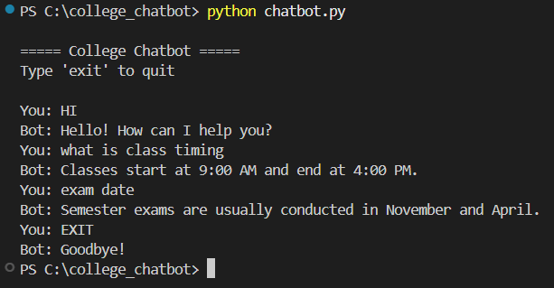

# 🎓 College Chatbot


---

## 📌 Overview

The **College Chatbot** is a rule-based intelligent system designed to answer frequently asked questions related to college activities such as class timings, exam schedules, lab rules, and more.

It provides quick and accurate responses using keyword matching techniques and can be extended with NLP capabilities.

---

## 🖼️ Project Preview



> 🔁 Replace this image with your own screenshot after running the project

---

## 🚀 Features

* 💬 Interactive command-line chatbot
* ⚡ Fast response using keyword matching
* 📚 Handles multiple college-related queries
* 🔧 Easily extendable using JSON
* 🧠 Can be upgraded with NLP (NLTK / spaCy)

---

## 🛠️ Tech Stack

* **Language:** Python
* **Data Format:** JSON
* **Concepts Used:** Rule-Based AI, String Matching

---

## 📁 Project Structure

```
college-chatbot/
│
├── chatbot.py        # Main chatbot program
├── utils.py          # Logic handling
├── intents.json      # Questions & responses
├── README.md         # Documentation
└── requirements.txt  # Dependencies
```

---

## ▶️ How to Run

### 1️⃣ Clone the Repository

```bash
git clone https://github.com/YOUR_USERNAME/college-chatbot.git
cd college-chatbot
```

### 2️⃣ Run the Chatbot

```bash
python chatbot.py
```

---

## 💬 Sample Interaction

```
You: hi  
Bot: Hello! How can I help you?

You: what is class timing  
Bot: Classes start at 9:00 AM and end at 4:00 PM.

You: exam date  
Bot: Semester exams are usually conducted in November and April.
```

---

## 🧠 Working Principle

1. User enters a query
2. Input is converted to lowercase
3. Keywords are matched with predefined patterns
4. Corresponding response is returned

---

## 📊 Advantages

* Simple and lightweight
* Easy to understand and implement
* No external dependencies required

---

## ⚠️ Limitations

* Cannot handle complex queries
* Limited to predefined responses
* No contextual understanding

---

## 🔮 Future Enhancements

* 🤖 NLP integration using NLTK or spaCy
* 🌐 Web interface using Flask / React
* 🎙️ Voice-based chatbot
* 🗂️ Database integration for dynamic responses

---

## 👨‍💻 Author

**Hadil KK**
B.E CSE (4th Semester)

---

## ⭐ Support

If you like this project, give it a ⭐ on GitHub!
